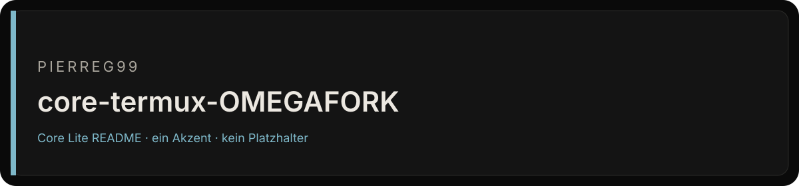

# core-termux-OMEGAFORK

OMEGA fork surface for the modular Core-Termux development environment.

<table><tr><td width="58%" valign="top">

### Bestand

Modular Termux development environment for build, coding and automation workflows. Existing commands, setup and agent documentation remains preserved in the archived README.

Der Default-Branch `main` ist die Fläche, die zählt. Was nicht in diesem Baum liegt, ist kein Feature dieses Repos.

</td><td width="42%" valign="top">

### Fakten

| Feld | Wert |
| --- | --- |
| Owner | Pierreg99 |
| Branch | `main` |
| Linie | OMEGA Fork |
| Thema | Termux Dev Environment |
| README | Cryo Core Lite v1.5 |

</td></tr></table>

## Lesen

1. Default-Branch öffnen.
2. Nur Dateien in diesem Baum als Beleg nehmen.
3. Shell-, Agent- und Runtime-Angaben gegen den tatsächlichen Repo-Stand prüfen.

## Bisherige Dokumentation

**[README.before-cryo-core-v1.5.md](./README.before-cryo-core-v1.5.md)** enthält die vorherige README vollständig.

## Grenze

Keine Qualitätszahl, kein Paketstand und keine Runtime, die nicht als Datei in diesem Repo steht.

Fläche nach Cryo Core Lite v1.5 · Tokens #0A0A0A / #141414 / #7EB8C9

